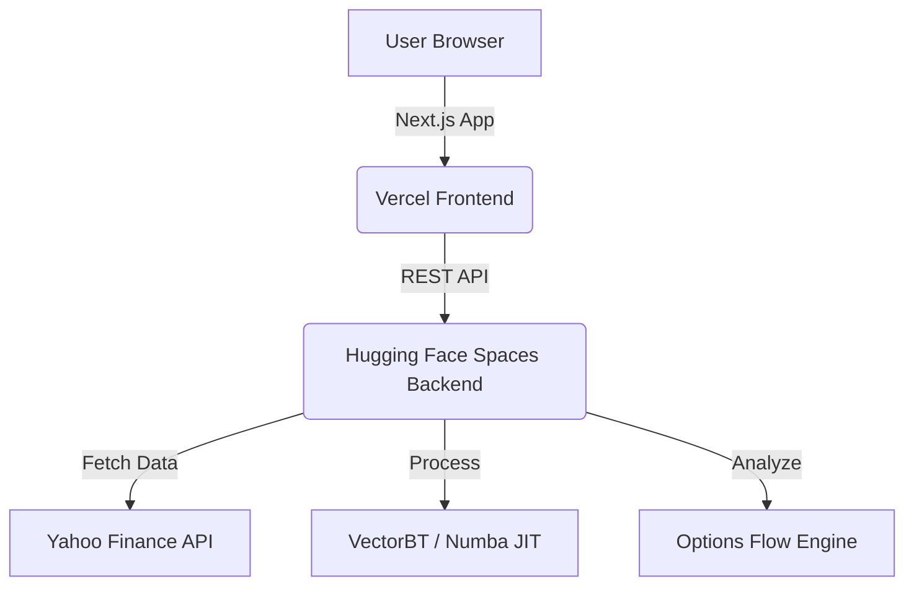

<div align="center">

# ⚡ TradeTerminal (HERMES)

**Professional-grade Financial Backtesting & Advanced LEAPS Options Analytics Platform**

[](https://fastapi.tiangolo.com/)
[](https://nextjs.org/)
[](https://www.python.org/)
[](https://vectorbt.dev/)
[](https://tailwindcss.com/)

[**Live Demo**](https://trade-terminal-vert.vercel.app) • [**Backend Docs**](https://arifkemall-tradeterminal.hf.space/docs) • [**Report Bug**](https://github.com/ArifKemal/TradeTerminal/issues)

</div>

---

## 📖 Overview

**TradeTerminal** (Codename: **HERMES**) is a high-performance financial analysis platform built for traders who demand speed and precision. Inspired by professional trading terminals like Bloomberg and Reuters, it features a sleek "Neon-Terminal" aesthetic (Black background with Orange accents) and provides powerful backtesting capabilities powered by **VectorBT**.

Beyond simple backtesting, TradeTerminal offers deep insights into **Options Flow**, specifically targeting **LEAPS** (Long-Term Equity Anticipation Securities) to identify unusual institutional activity and long-term market sentiment anomalies.

---

## ✨ Key Features

### 🚀 Advanced Backtesting Engine
- **Strategy Suite:** SMA Crossover, EMA Crossover, and Bollinger Bands mean-reversion.
- **Technical Indicators:** High-fidelity RSI and MACD integration.
- **Interactive Visualization:** Professional-grade Candlestick, Volume, Equity Curve, and Drawdown charts using Plotly.js.
- **Strategy Comparison:** Benchmark multiple strategies simultaneously against the same asset.

### 🔍 LEAPS & Options Analytics
- **LEAPS Scanner:** Concurrent scanning of S&P 100 tickers (~10s) to detect unusual long-dated option activity.
- **Unusual Activity Detection:** Automated detection of Volume/Open Interest spikes (2x+ anomalies).
- **Options Flow Dashboard:** Full chain analysis for individual tickers including Call/Put volume ratios and expiration-specific metrics.

### 🏢 Corporate Fundamentals
- **Real-time Valuation:** Instant access to Market Cap, P/E, P/B, EV/EBITDA, ROE, Beta, and more.
- **Business Insights:** Comprehensive company summaries and sector/industry classification.

---

## 🏗️ Architecture

TradeTerminal follows a modern **Monorepo** architecture, deployed as a distributed system for optimal performance and cost-efficiency.



### Stack Detail
- **Frontend:** Next.js 16 (App Router), TypeScript, Tailwind CSS v4, Plotly.js.
- **Backend:** FastAPI, Python 3.11, VectorBT, yfinance, Pandas, Numba (JIT compilation for speed).
- **Deployment:** Vercel (Frontend) & Hugging Face Spaces (Backend with 16GB RAM / 2 vCPU).

---

## 📁 Project Structure

```text
tradeterminal/
├── frontend/                    # Next.js Application
│   ├── app/                     # App Router pages & API clients
│   └── components/              # Modular UI components (Charts, Forms, Panels)
├── backend/                     # FastAPI Application
│   ├── main.py                  # API Endpoints & Orchestration
│   ├── strategies.py            # VectorBT Strategy implementations
│   ├── options_flow.py          # Options chain analysis logic
│   └── leaps_scanner.py         # Concurrent S&P 100 scanner
└── PROJECT.md                   # Internal technical documentation
```

---

## 🛠️ Local Development

### Prerequisites
- **Python 3.11+**
- **Node.js 20+**
- **npm** or **yarn**

### 1. Backend Setup
```bash
cd backend
python -m venv venv
source venv/bin/activate  # Windows: venv\Scripts\activate
pip install -r requirements.txt
python main.py
# Server starts at http://localhost:8000
```

### 2. Frontend Setup
```bash
cd frontend
npm install
npm run dev
# Dashboard starts at http://localhost:3000
```

---

## 🚀 Deployment Guide

### Frontend (Vercel)
1. Connect your GitHub repository to [Vercel](https://vercel.com).
2. Set **Root Directory** to `frontend`.
3. Configure Environment Variable:
   - `NEXT_PUBLIC_API_URL`: Your backend URL (e.g., `https://your-space.hf.space`)
4. Deploy.

### Backend (Hugging Face Spaces)
1. Create a new **Docker** Space on [Hugging Face](https://huggingface.co/spaces).
2. Upload the contents of the `backend/` directory to the Space root.
3. Configure **Repository Secret**:
   - `FRONTEND_URL`: Your Vercel frontend URL.
4. The Space will automatically build and start the Docker container.

---

## 📡 API Reference

| Endpoint | Method | Description |
|----------|--------|-------------|
| `/api/backtest` | `POST` | Execute a backtest with custom parameters. |
| `/api/compare` | `POST` | Benchmark all strategies for a given ticker. |
| `/api/leaps/scanner` | `GET` | Scan S&P 100 for LEAPS anomalies. |
| `/api/ticker/{sym}/options-flow` | `GET` | Detailed options chain analysis. |
| `/api/ticker/{sym}/fundamentals` | `GET` | Company valuation and financial metrics. |

---

## ⚠️ Troubleshooting & Performance

- **Numba Cold Starts:** The first backtest may take ~15s due to JIT compilation. The backend uses a pre-warmup script to mitigate this.
- **yfinance Reliability:** The system includes `curl_cffi` to bypass common scraping blocks and ensure data consistency.
- **Memory Management:** VectorBT analysis is memory-intensive; hence the deployment on Hugging Face Spaces with 16GB RAM.

---

## 📄 License

This project is licensed under the **MIT License**. See [LICENSE](LICENSE) for details.

<div align="center">

**⭐ If you find this project useful, please consider giving it a star!**

</div>
